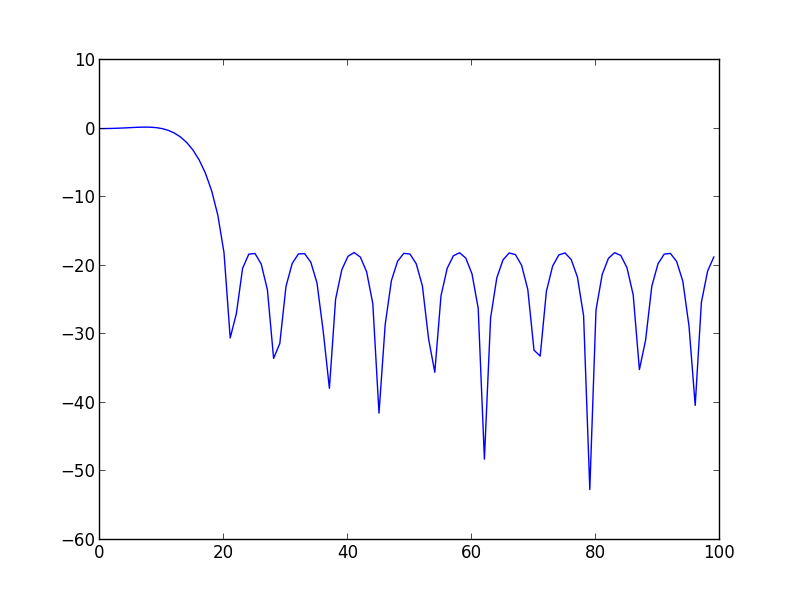

pyspuc
======

Python extensions for spuc library (github.com/audiofilter/spuclib) using boost python

This builds OK on both Mac and Linux 

### Build status - Linux, clang - Automated Travis Build

Requirements:

		boost
		python
		cmake
		spuclib

		boost/python/cmake install via Homebrew or Apt-get
		(for Homebrew boost-python install now boost-python and separate from boost)

		# this builds needed libraries for linking
		git clone https://github.com/audiofilter/spuclib.git
		cd spuclib; mkdir build; cd build; cmake ..; make

		(see .travis.yml for install steps if needed)
		cd build
		cmake ..
		make

